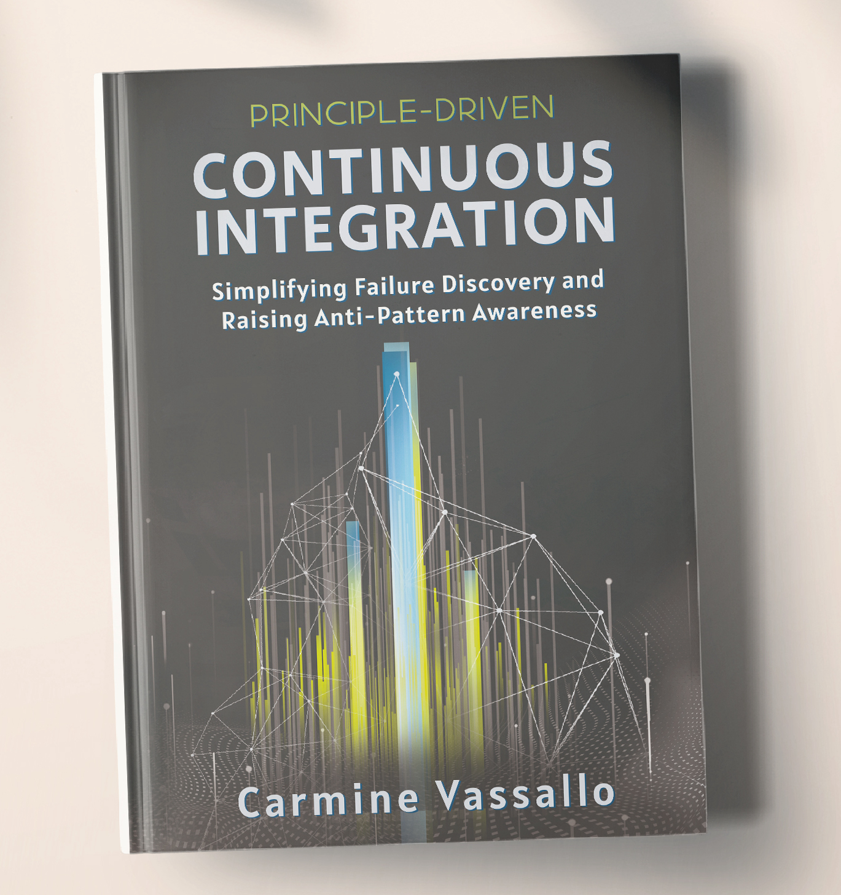

Hi, I am Carmine Vassallo and I love accelerating software development processes using a scientific approach. 

In the last years, I focused on easing the adoption of Continuous Integration (CI) within software development teams. We developed tools that speed up the resolution time of failures occurring on [Jenkins](https://www.jenkins.io/) servers. We also identified deviations from CI best practices (called anti-patterns) looking at [GitLab](https://about.gitlab.com/) configurations and build logs.

Currently, I am a senior DevOps engineer at [Avaloq](https://www.avaloq.com/en/home), part of NEC Corporation, in Zurich, Switzerland. We build our own software banking suite which is used by Barclays, HSBC, and other major banks worldwide. In my role, I take ownership of build tools and architect the next automation tasks, fostering a DevOps mindset.

I hold a PhD in computer science from the [University of Zurich](https://www.uzh.ch/cmsssl/en.html). I co-authored 14 [articles on CI/CD topics](https://scholar.google.ch/citations?user=RwDNiTAAAAAJ&hl=en) published at top-tier peer-reviewed conferences and journals in the field of software engineering.

*Read my doctoral dissertation [here](http://carminevassallo.com/publications/VassalloPhDThesis.pdf)*

<!--
{}


{:height="12px" width="12px"}


picture of my dissertation

> **WARNING: This website is under construction.** Please visit my [institutional website](https://www.ifi.uzh.ch/en/seal/people/vassallo.html). --!>